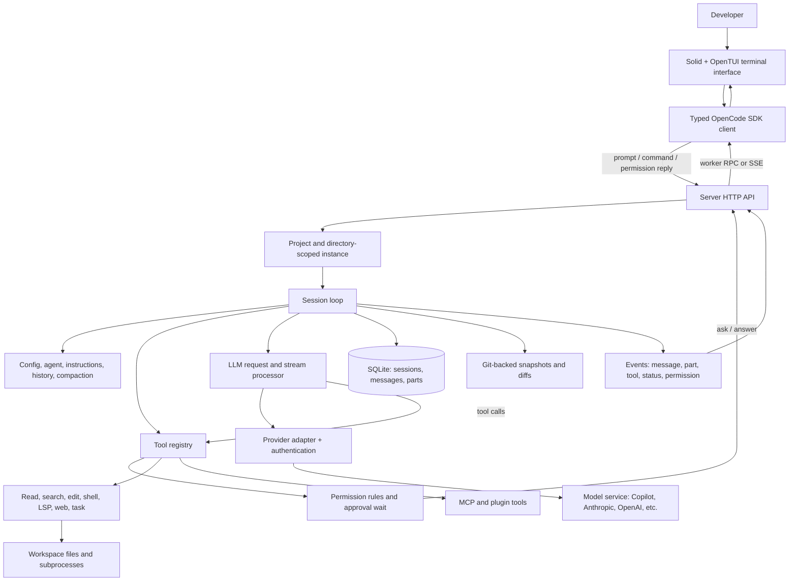
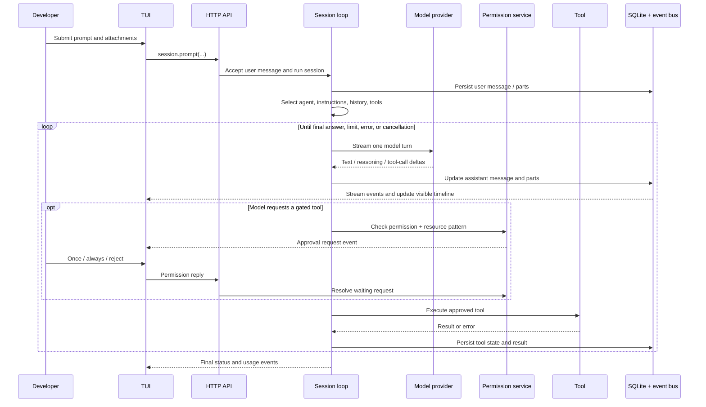

# OpenCode architecture, from prompt to filesystem

This is a source-based map of OpenCode at [`696f41bc`](https://github.com/anomalyco/opencode/tree/696f41bc8e7586657375d53390925fc54c25d34c) (2026-09-25). OpenCode is changing quickly, especially its session engine. The diagram describes the **default full-screen TUI path in this snapshot**; the newer V2 session path is called out separately below. This is an explanation of OpenCode, not a claim that turbo-code implements the same boundaries.

## The architecture in one picture

The important separation is that the TUI is a **client**. It does not directly call the model or run the agent loop. The server owns sessions, tool execution, permissions, providers, and persistence. The default local TUI starts a worker containing that server and makes in-process HTTP-like requests over RPC; when OpenCode is exposed on a port, the same client uses an HTTP URL and server-sent events (SSE). See the [CLI TUI launcher](https://github.com/anomalyco/opencode/blob/696f41bc8e7586657375d53390925fc54c25d34c/packages/opencode/src/cli/cmd/tui.ts), [worker](https://github.com/anomalyco/opencode/blob/696f41bc8e7586657375d53390925fc54c25d34c/packages/opencode/src/cli/tui/worker.ts), and [TUI SDK context](https://github.com/anomalyco/opencode/blob/696f41bc8e7586657375d53390925fc54c25d34c/packages/tui/src/context/sdk.tsx).

## What happens when you send a prompt

In the default path, the composer calls `session.prompt` on the SDK. The HTTP session handler delegates to `SessionPrompt`; its loop reloads message history, handles pending subtasks or compaction, chooses the agent and model, resolves available tools, constructs system context, and asks `SessionProcessor` to consume the model stream. The processor updates message parts as text, reasoning, tool calls, tool results, errors, and usage arrive. See the [composer](https://github.com/anomalyco/opencode/blob/696f41bc8e7586657375d53390925fc54c25d34c/packages/tui/src/component/prompt/index.tsx), [session endpoint](https://github.com/anomalyco/opencode/blob/696f41bc8e7586657375d53390925fc54c25d34c/packages/opencode/src/server/routes/instance/httpapi/handlers/session.ts), [loop](https://github.com/anomalyco/opencode/blob/696f41bc8e7586657375d53390925fc54c25d34c/packages/opencode/src/session/prompt.ts), and [processor](https://github.com/anomalyco/opencode/blob/696f41bc8e7586657375d53390925fc54c25d34c/packages/opencode/src/session/processor.ts).

The model supplies a *requested* tool call. OpenCode resolves and executes that call locally, records the result, and gives the result to the next provider turn. This is why the provider is an adapter inside OpenCode's loop, not the owner of the loop. The [LLM service](https://github.com/anomalyco/opencode/blob/696f41bc8e7586657375d53390925fc54c25d34c/packages/opencode/src/session/llm.ts) and [tool registry](https://github.com/anomalyco/opencode/blob/696f41bc8e7586657375d53390925fc54c25d34c/packages/opencode/src/tool/registry.ts) show the boundary.

## What each part does

| Part | Responsibility | Where to read |
| --- | --- | --- |
| CLI and TUI | Parse commands and flags; render session, composer, tools, permissions, sidebar; send actions through the SDK. The full-screen UI uses Solid and OpenTUI. | [CLI entry](https://github.com/anomalyco/opencode/blob/696f41bc8e7586657375d53390925fc54c25d34c/packages/opencode/src/index.ts), [TUI package](https://github.com/anomalyco/opencode/tree/696f41bc8e7586657375d53390925fc54c25d34c/packages/tui/src) |
| SDK and transport | Provide typed requests and an event stream. Local mode forwards requests/events to the server worker over RPC; remote mode uses HTTP/SSE. TUI batches incoming events for rendering. | [TUI launcher](https://github.com/anomalyco/opencode/blob/696f41bc8e7586657375d53390925fc54c25d34c/packages/opencode/src/cli/cmd/tui.ts), [SDK context](https://github.com/anomalyco/opencode/blob/696f41bc8e7586657375d53390925fc54c25d34c/packages/tui/src/context/sdk.tsx) |
| HTTP server and instance | Expose sessions, files, providers, MCP, permissions, events and other operations. Route a request to the selected project/directory/workspace and construct its services. | [Server route graph](https://github.com/anomalyco/opencode/blob/696f41bc8e7586657375d53390925fc54c25d34c/packages/opencode/src/server/routes/instance/httpapi/server.ts) |
| Session orchestration | Admit a prompt; choose agent/model; assemble instructions and history; repeat provider turns until complete; handle cancellation, retries, compaction and subtasks. | [Session prompt](https://github.com/anomalyco/opencode/blob/696f41bc8e7586657375d53390925fc54c25d34c/packages/opencode/src/session/prompt.ts), [session tools](https://github.com/anomalyco/opencode/blob/696f41bc8e7586657375d53390925fc54c25d34c/packages/opencode/src/session/tools.ts) |
| Provider and model layer | Discover/configure models, obtain credentials, adapt provider-specific APIs and request formats, and normalize streamed model output. GitHub Copilot is one provider, not the agent runtime. | [Provider](https://github.com/anomalyco/opencode/blob/696f41bc8e7586657375d53390925fc54c25d34c/packages/opencode/src/provider/provider.ts), [Copilot adapter](https://github.com/anomalyco/opencode/blob/696f41bc8e7586657375d53390925fc54c25d34c/packages/core/src/github-copilot/copilot-provider.ts), [LLM service](https://github.com/anomalyco/opencode/blob/696f41bc8e7586657375d53390925fc54c25d34c/packages/opencode/src/session/llm.ts) |
| Tool registry and executors | Offer built-in and extension tools to the model, validate arguments, run local operations, truncate large output, and support child tasks. | [Registry](https://github.com/anomalyco/opencode/blob/696f41bc8e7586657375d53390925fc54c25d34c/packages/opencode/src/tool/registry.ts), [tool directory](https://github.com/anomalyco/opencode/tree/696f41bc8e7586657375d53390925fc54c25d34c/packages/opencode/src/tool) |
| Permissions | Match tool/action and resource patterns against agent, user and session rules. On `ask`, publish a request and suspend the tool until the UI replies; `always` adds matching rules for the running instance. | [Permission service](https://github.com/anomalyco/opencode/blob/696f41bc8e7586657375d53390925fc54c25d34c/packages/opencode/src/permission/index.ts), [TUI permission view](https://github.com/anomalyco/opencode/blob/696f41bc8e7586657375d53390925fc54c25d34c/packages/tui/src/routes/session/permission.tsx) |
| State and event projection | Store sessions, messages and parts in SQLite; publish live changes; update TUI state from message/part/status/permission events. Session UI state is a projection of server state. | [SQL tables](https://github.com/anomalyco/opencode/blob/696f41bc8e7586657375d53390925fc54c25d34c/packages/core/src/session/sql.ts), [event bridge](https://github.com/anomalyco/opencode/blob/696f41bc8e7586657375d53390925fc54c25d34c/packages/opencode/src/event-v2-bridge.ts), [TUI sync](https://github.com/anomalyco/opencode/blob/696f41bc8e7586657375d53390925fc54c25d34c/packages/tui/src/context/sync.tsx) |
| File recovery and review | Track Git-backed snapshots/diffs around tool work and support session revert; the project workspace remains where file edits actually happen. | [Snapshot service](https://github.com/anomalyco/opencode/blob/696f41bc8e7586657375d53390925fc54c25d34c/packages/opencode/src/snapshot/index.ts), [revert service](https://github.com/anomalyco/opencode/blob/696f41bc8e7586657375d53390925fc54c25d34c/packages/opencode/src/session/revert.ts) |
| Context and extensions | Merge config and project instructions, define Build/Plan agents, attach skills/plugins/MCP tools, and start language servers for code intelligence. | [Config](https://github.com/anomalyco/opencode/blob/696f41bc8e7586657375d53390925fc54c25d34c/packages/opencode/src/config/config.ts), [agents](https://github.com/anomalyco/opencode/blob/696f41bc8e7586657375d53390925fc54c25d34c/packages/opencode/src/agent/agent.ts), [instructions](https://github.com/anomalyco/opencode/blob/696f41bc8e7586657375d53390925fc54c25d34c/packages/opencode/src/session/instruction.ts), [MCP](https://github.com/anomalyco/opencode/blob/696f41bc8e7586657375d53390925fc54c25d34c/packages/opencode/src/mcp/index.ts), [LSP](https://github.com/anomalyco/opencode/blob/696f41bc8e7586657375d53390925fc54c25d34c/packages/opencode/src/lsp/lsp.ts) |

## The session-model transition matters

The repository contains **two session implementations**. The default TUI's `session.prompt` endpoint in this snapshot calls the older `SessionPrompt` loop, using `SessionV1` messages/parts and `MessageV2` conversion/projection. The server also mounts a newer typed API backed by `packages/core/src/session/`: `SessionV2.prompt` durably admits a `session_input`, a process-local execution coordinator drains admitted work, and a location-scoped runner performs provider turns. This is an active migration, not two layers that every prompt necessarily traverses. See the [legacy HTTP handler](https://github.com/anomalyco/opencode/blob/696f41bc8e7586657375d53390925fc54c25d34c/packages/opencode/src/server/routes/instance/httpapi/handlers/session.ts), [server route mounting](https://github.com/anomalyco/opencode/blob/696f41bc8e7586657375d53390925fc54c25d34c/packages/opencode/src/server/routes/instance/httpapi/server.ts), [V2 prompt admission](https://github.com/anomalyco/opencode/blob/696f41bc8e7586657375d53390925fc54c25d34c/packages/core/src/session.ts), and [V2 runner](https://github.com/anomalyco/opencode/blob/696f41bc8e7586657375d53390925fc54c25d34c/packages/core/src/session/runner/index.ts).

The distinction is useful when reading OpenCode: `sdk/v2` is the generated *client API version* used by the TUI; it does not mean that every TUI prompt is handled by the new `SessionV2` engine. Follow the route implementation to determine which engine a request reaches.

## What this means for turbo-code

The main architectural lesson is the ownership boundary: OpenCode's UI displays a server-owned, persisted session; the harness assembles context, selects tools, enforces permissions, executes local work and advances the model/tool loop. Its Copilot adapter supplies model access to that loop. Turbo-code currently uses the Copilot SDK/CLI for orchestration, so matching OpenCode's layout alone does not reproduce its execution architecture. See the [cross-harness roadmap](cross-harness-roadmap.md) for turbo-code's specific gaps and transport decision.
